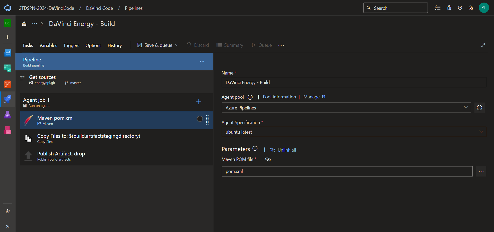
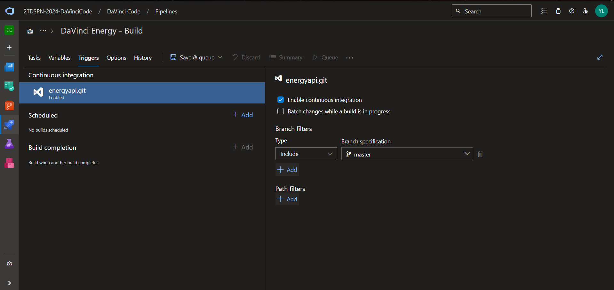
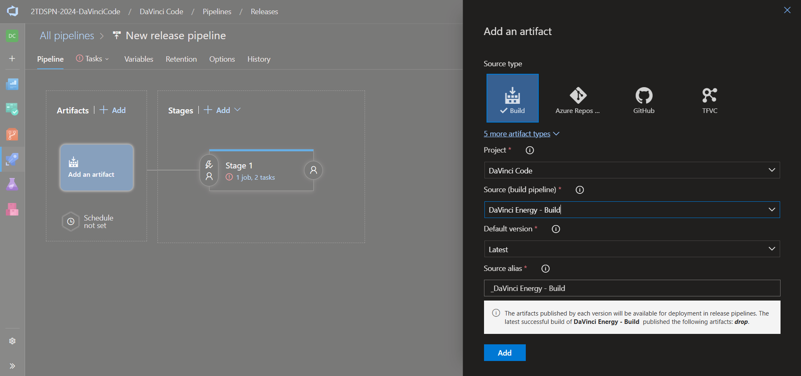
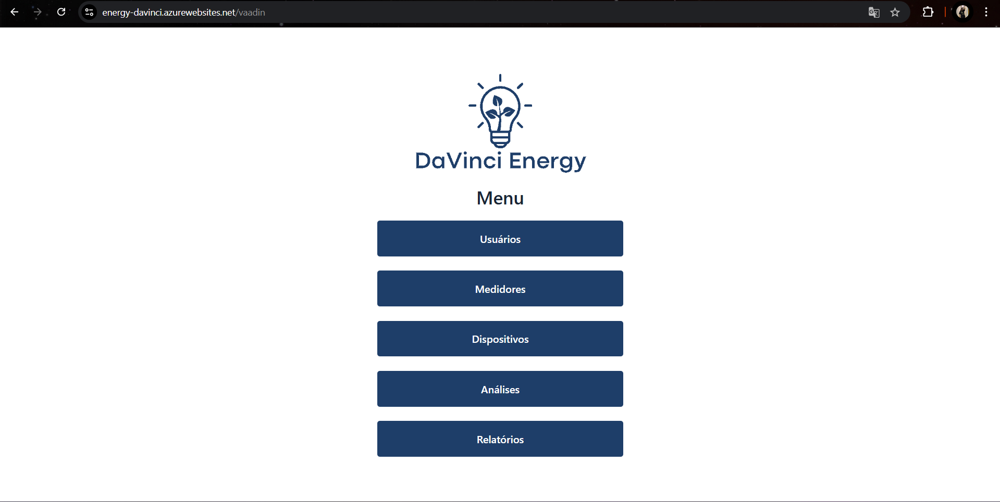

# DaVinci Energy - Plataforma de Monitoramento de Eficiência Energética

A DaVinci Energy é uma plataforma que visa ajudar residências e pequenos comércios a monitorar, controlar e otimizar o consumo de energia elétrica, com base na tabela de eficiência energética do Inmetro. Utilizando dispositivos de medição e inteligência de dados, a solução oferece dados importantes sobre o consumo de cada aparelho, auxilia na escolha de dispositivos mais eficientes e orienta o usuário a reduzir desperdícios, promovendo um uso consciente, econômico e sustentável de energia.

Para acessar nossa plataforma, acesse o link: https://energy-davinci.azurewebsites.net/vaadin

## DaVinci Energy - Spring Boot MVC Application

Esse projeto é a solução desenvolvida pela Startup `DaVinci`, direcionada a usuários comuns e a micro/pequenas empresas que querem monitorar a eficiência energética de seus aparelhos. Com isso, visamos maximizar a forma com que os usuários interagem com a energia, evitando desperdicíos.


### Equipe Desenvolvedora

- API Spring Boot MVC com Vaadin desenvolvido por Cássio Yuji - Desenvolvedor Full-Stack
#### Contato: cassiyu551491@gmail.com

- Criação e gerenciamento da infraestrutura da aplicação e de recursos necessários para seu funcionamento desenvolvido por Yasmin Lopes - Cloud Enginner and Devops
#### Contato: yaslopeseyweb@gmail.com

## Requisitos

- Conta na Azure com créditos para criar recursos
- Conta no Azure DevOps

# Guia para a implementação do Deploy por Pipeline na Azure

Siga o passo a passo abaixo para que consiga replicar a infraestrutura utilizada para o deploy da aplicação DaVinci Energy.

## Criando os recursos de cloud da Azure via Azure CLI

### 1. Faça o login na Azure via terminal
    ```
    bash
    # Faça login no Azure CLI com usuário e senha

    az login --username <seu-email> --password <sua-senha>

    # Verificar se o login foi bem-sucedido

    az account show
    ```

### 2 Crie um Resource Group na sua subscrição da Azure
    ```
    bash
    az group create --name RG-davinci-energy --location brazilsouth
    ```
### 3. Crie um server do banco de dados Azure SQL

    ```
    bash
    # Criar o servidor SQL

    az sql server create \
    --name sr-davinci-energy \
    --resource-group RG-davinci-energy \
    --location brazilsouth \
    --admin-user adm-davinci \
    --admin-password fiap@2024
    ```

### 4. Configure o firewall para acesso ao server 
    ```
    bash

    az sql server firewall-rule create \
    --resource-group RG-davinci-energy \
    --server sr-davinci-energy \
    --name AllowAllIPs \
    --start-ip-address 0.0.0.0 \
    --end-ip-address 255.255.255.255

    ```

### 5. Crie o banco de dados

    ```
    bash

    az sql db create \
    --resource-group RG-davinci-energy \
    --server sr-davinci-energy \
    --name db-davinci-energy \
    --edition GeneralPurpose \   # Define a camada de serviço
    --service-objective GP_S_Gen5_1  # General Purpose - Serverless, Gen5 com 1 vCore

    ```
### 6. Crie o Web App

    ```
    bash
    az webapp create \
    --name davinci-energy-app \
    --resource-group RG-davinci-energy \
    --plan asp-davinci-energy \
    --location brazilsouth \
    --sku B2
    ```

Com toda essa infraestrutura criada, agora iremos para o Azure DevOps, para que possamos desenvolver o Build e a Release, que no caso desse passo a passo, será vinculado ao Azure Repos.

## Configurando o Azure DevOps

### 1. Importe o projeto no Azure Repos
Ao entrar no Azure DevOps, selecione a opção "Repos"


Selecione essa opção em vermelho com o nome do seu projeto e, depois, clique na opção "Import repository"


Essa janela irá se abrir e você deve colar o link do repositório do projeto, que no caso é 'https://github.com/yaslopesyweb/energyapi.git' e então clicar no botão escrito "Import"


E assim, você terá o projeto importado.


### 2. Adicionando as strings de conexão com o banco de dados no projeto

Inicialmente, é necessário pegar essa string de conexão do banco de dados, via terminal com o comando abaixo:

    ```
    bash
    az sql db show-connection-string \
    --server sr-davinci-energy \
    --name db-davinci-energy
    ```

Copie a string de conexão e a coloque no arquivo `application.properties` que fica no caminho `src/main/resources`, alterando `your_username` para `adm-davinci` e `your_password` para `fiap@2024`. Após realizar todos esse passos, clique em "Commit" para salvar as alterações que foram feitas.

### 3. Configurando a Pipeline: Build
No seu Azure DevOps, passe o mouse por essa opção e clique em "Pipelines"


Agora selecione "Create Pipeline" e depois em "Use the classic editor", chegando até esta tela. Note que por só ter esse projeto no repos dessa organização, ele já aparece selecionado. Por isso, selecione a opção "Continue"


Por se tratar de uma aplicação em Java, procure a opção "Maven" e clique em "Apply"


Nesta tela, iremos começar as alterações. Em `Name` coloque `DaVinci Energy - Build`; em `Agent Pool` selecione a opção `Azure Pipelines`; em `Agent Specification` selecione `ubuntu latest`.


Selecione a opção `Agent job 1` e faça as alterações a seguir. Em `Display name` coloque como `Build`;  em `Agent Pool` Selecione a opção `Azure Pipelines`; em `Agent Specification` selecione `ubuntu latest`.


Ao clicar em "Maven pom.xml", desça até a opção "Advanced", clique nela e em `JDK version` selecione `JDK 17`


Agora na aba de funcionalidades, selecione a opção "Triggers" e habilite a opção "Enable continuous integrations". E clique em "Save & queue".


Após esperar alguns minutos, nosso Build é criado com sucesso e agora poderemos partir para a Release.


### 4. Configurando a Pipeline: Release

Em sua página inicial, passe o mouse sobre "Pipeline" e clique na opção "Release".


Agora, clique na opção "New Pipeline" e selecione a opção "Deploy a Java app to Azure Service" e clique em "Apply".


Selecione a opção "Add an artifact" e em "Source", selecione o nosso build que neste caso é "DaVinci Energy - Build" e depois, cique em "Add".


Habilite o Continuous deployment trigger clicando no raio do Artifacts e habilitando a primeira opção.


Em "Stage 1", clique na linha azul e posteriormente em "Run on agent" e em `Agent Pool` selecione a opção `Azure Pipelines` e depois em `Agent Specifications` selecione `ubuntu-latest`.


Na opção "Azure Web App Deploy", faça as alterações: em `Azure subscription`, seleciona a subscrição que criou seus recursos na Azure e se não estiver habilitado, clique no botão `Authorize`; em `App type` selecione `Web App on Linux`; em `App name` selecione o web app que criou. Após todas essas alterações serem feitas, clique em "Save" e depois em "Create Release".


Ao final do processo, a tela deverá ficar assim e você poderá acessar a aplicação entrando no domínio do seu Web App adicionando uma `/vaadin`.


Essa é a tela inicial da nossa aplicação:



